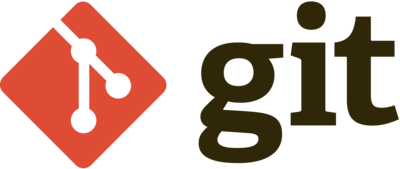

# Git 是什麼？

假如我們今天在電腦上面打一個文件，我們要怎麼存檔？我們以 Word 舉例，你有兩種方式：按「存檔」，或是按 command + S(ctrl + S for windows)。

好，你現在有文件最新的版本了，但是你突然發現你改了一整天的版面後，覺得昨天的版面比較好看，你要怎麼回復到一天前的版面？

除非你在每一次保存的時候都是用「另存新檔」，並且額外花時間命名每一個文件的時間，否則基本上你是沒有辦法回到你想要的版本，因為你的電腦只有保存最新的檔案，一天前的已經被覆蓋過去了。

這個時候，你就需要一個「版本控制系統」（Version control system）來記錄每一個版本的資訊。

具體運作方式為：做完每一個小進度後（例如：改完一個版面、撰寫完自我介紹），將當前的版本紀錄下來，保存在電腦上。這樣你的電腦上就會有每一個版本的資訊，如果你想要回到指定的版本，只要點開那個版本紀錄，文件就會自動回復到你指定的版本。

git 就是一個版本控制系統，藉由每次在存檔的時候輸入一串 commit message 來簡述這個版本修改了什麼，再儲存到電腦上面，這樣就可以透過每一個 commit message 來知道每個版本在幹嘛。

git 的教學我這邊就不多做贅述，網路上已經有很多有關 git 的教學了，這邊推薦幾個我學習 git 用的教材。

* [PAPAYA 的 git 介紹影片](https://youtu.be/FKXRiAiQFiY?si=PdhPudluymdW_Z7d)
* [git 的語法介紹和實作](https://tai-da-zi-guan.gitbook.io/tai-da-zi-guan-docs/jian-jie)
* [GitHub 上讓你練習 contribute 的 repo](https://github.com/firstcontributions/first-contributions)

理論上來說，只要你開始寫一個程式專案，或是你要跟別人協作，就會使用到 git。

關於怎麼多人協作，後面的章節會說明，只要先記得「你一定會一直用 git」就對了