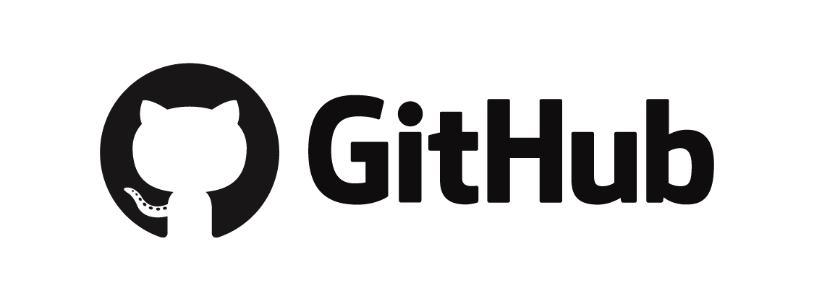
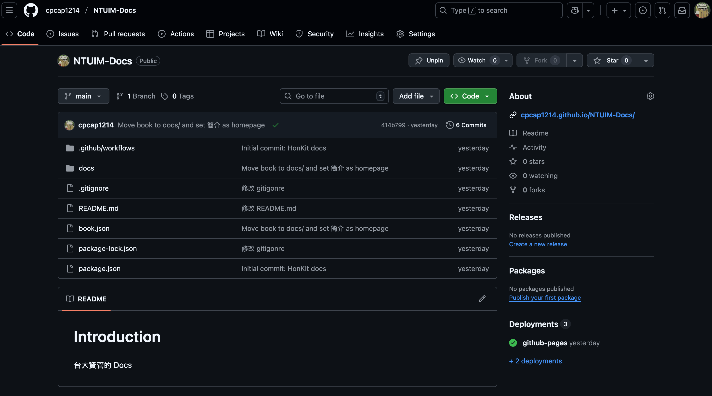
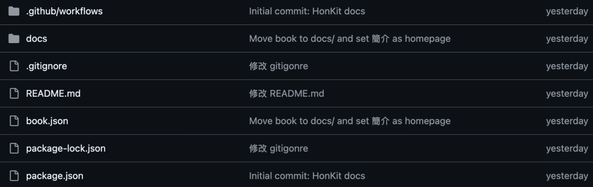
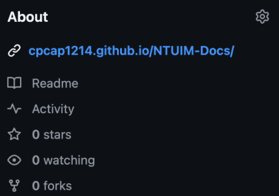

# GitHub 是什麼？

如果你有聽過 git，應該多多少少都有聽過 GitHub 吧，有些人會把兩個東西搞混，不知道有什麼差別。

如果說 git 是一個版本控制系統，那麼 GitHub 就是託管 Git 儲存庫的服務平台。

也就是說，你可以把 GitHub 想像成一個放置 git 專案的網站，讓你可以把你的 git 專案放到網路上，這樣你就可以從任何一台電腦存取你的專案。

當然，這個 git 專案可以是用任何一種程式語言，只要你放到上面，任何人都可以下載下來使用。

## gihub 的優點

GitHub 的好處在於它可以讓你很方便地跟別人協作。

假設你今天有一個專案，你想要找別人一起幫你開發，這個時候你就可以把你的專案放到 GitHub 上面，然後邀請別人來幫你開發。    

這樣別人就可以從 GitHub 上面下載你的專案，然後在自己的電腦上面修改，修改完之後再把修改的部分傳回 GitHub 上面，這樣你就可以看到別人修改了什麼，你也可以把別人的修改合併到你的專案裡面。

另一個好處就是「分享自己的專案」。

有些人做了一些很實用的專案，像是一個電腦 App，一個瀏覽器的插件，只要他把這個專案設成公開，任何一個人就可以把他的源代碼下載下來，並且做使用。

你現在看到的這個 Docs，就是我把這個專案放在 GitHub 上，讓所有人都可以看到。

這種形式也叫做「開源」（Open source），全名是「開放原始碼」，意思是你可以自由的使用這個專案。

> 注意：「自由使用」不代表你有這個專案的「授權」，如果你想要用這個專案來盈利的話，通常還是會有一些條件，像是你要註明你用了這個專案，甚至有些條款會要求你連賺錢的服務都要開源，詳細的條款可以[參考這篇](https://noob.tw/open-source-licenses/)

## GitHub 介面介紹

我們以「[台大資管 Docs](https://github.com/cpcap1214/NTUIM-Docs?tab=readme-ov-file#readme)」為例，這一個頁面就是一個專案（repository）。

看起來很複雜，其實就是由三個主要的部分組成

### 檔案

出現在畫面正中間的是這一個專案的所有檔案，也就是所有的 code 都顯示在這邊。

最左邊的是檔案名稱，有些會是資料夾，可以點開來然後看裡面檔案的詳細資料。

中間的是這一個檔案、資料夾最近一次更動的 commit message，最右邊的就是最近一次的 commit 時間。

通常在修改專案的時候不會每一個檔案都動到，所以有一些檔案的 commit 時間就會不一樣，上圖都顯示 yesterday 只是巧合。

### 介紹

出現在畫面右上角的是這一個專案的介紹，會簡述這個專案在幹嘛，以及放連結，像是這個專案的連結就是連到台大資管 Docs 的。

#### Readme

會跳到這個專案的詳細介紹，等等會提到。

#### Activity

可以看到這個專案的所有動態，像是誰更改了什麼部分，誰為這個專案貢獻。

#### Stars

就像 ig 的按讚數，代表對這個專案的肯定，通常 Stars 數越高，代表這個專案越有影響力，當然也有可能有灌水的嫌疑，不過我是覺得沒有人這麼無聊啦。

有些專案會有數萬，甚至數十萬的 Stars，代表這個專案真的很強，或是超級有用，像是 GitHub 上面最多星星的專案 [freeCodeCamp](https://github.com/freeCodeCamp/freeCodeCamp) 就是提供學習程式的免費教材，有超過 429K 的星星，真的很強。

#### Watching

字面上的意思，幾個人在看這個專案

#### Forks

這個中文我其實不太知道怎麼翻譯，字面上的意思的話，就是叉子，但是這邊的意思是「拿一份源代碼，然後變成自己的專案」，之後會詳細介紹。

因為叉子有分岔，所以意思就是從同一個專案延伸出來不同的叉，代表你複製到你帳號的代碼不會影響到原本的專案。

### 詳細介紹

出現在畫面下方的是這一個專案的詳細介紹，與剛剛提到的介紹不一樣，這邊是由一個叫做 README.md 的檔案構成，簡單來說就是這邊顯示的就是你剛剛在檔案中看到的 README.md 檔。

這邊會完整的介紹這個專案在幹嘛，通常會有「介紹」、「如何使用」、「如何 contribute」、「貢獻者名單」組成。

關於 contribute 的部分會在多人協作講到，你可以先理解成「優化這個專案」。

## 練習

試試看在 GitHub 上面做第一個動作吧！你可以按[這個專案](https://github.com/cpcap1214/NTUIM-Docs) Star，我會很感謝你的～

## 結語

GitHub 就像是工程師的 ig，隨時都有一些酷酷的專案在上面，而且重點是每個人都可以修改成自己喜歡的樣字。

像是我最喜歡的專案是這個 [CapsLockNoDelay](https://github.com/gkpln3/CapsLockNoDelay)，因為我是用 mac，所以要按 caps lock 切換語言。

但是每次按的時候都會有延遲，啊這個專案就是一個把延遲取消的 app，超級實用。